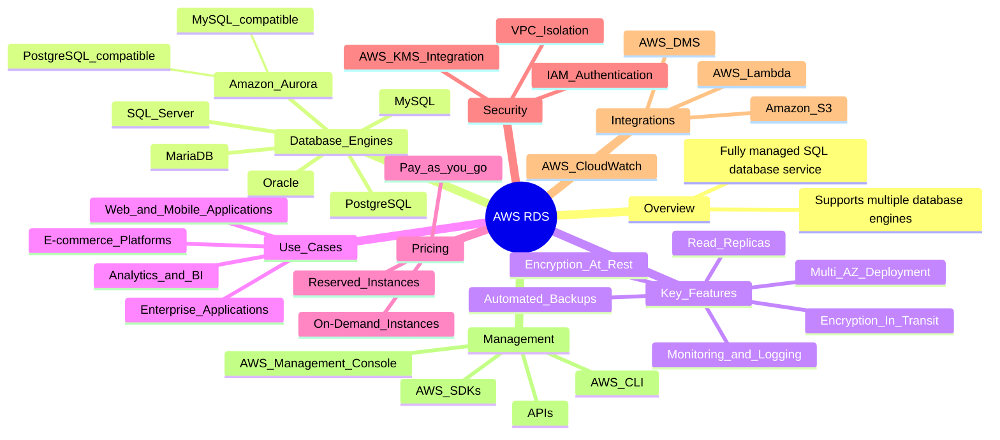

```mermaid
mindmap
  root((AWS RDS))
    Overview
      Fully managed SQL database service
      Supports multiple database engines
    Database_Engines
      Amazon_Aurora
        MySQL_compatible
        PostgreSQL_compatible
      MySQL
      MariaDB
      PostgreSQL
      Oracle
      SQL_Server
    Key_Features
      Automated_Backups
      Multi_AZ_Deployment
      Read_Replicas
      Encryption_At_Rest
      Encryption_In_Transit
      Monitoring_and_Logging
    Use_Cases
      Web_and_Mobile_Applications
      E-commerce_Platforms
      Enterprise_Applications
      Analytics_and_BI
    Pricing
      Pay_as_you_go
      Reserved_Instances
      On-Demand_Instances
    Security
      VPC_Isolation
      IAM_Authentication
      AWS_KMS_Integration
    Integrations
      AWS_Lambda
      Amazon_S3
      AWS_CloudWatch
      AWS_DMS
    Management
      AWS_Management_Console
      AWS_CLI
      AWS_SDKs
      APIs


```