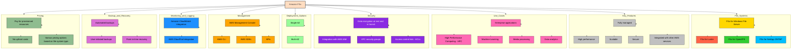

```mermaid
graph TD
  A[Amazon FSx]:::main
  
  subgraph File_Systems
    FS1[FSx for Windows File Server]:::windows
    FS2[FSx for Lustre]:::lustre
    FS3[FSx for OpenZFS]:::openzfs
    FS4[FSx for NetApp ONTAP]:::netapp
  end
  
  subgraph Key_Features
    KF1[Fully managed]:::features
    KF2[High performance]:::features
    KF3[Scalable]:::features
    KF4[Secure]:::features
    KF5[Integrated with other AWS services]:::features
  end
  
  subgraph Use_Cases
    UC1[Enterprise applications]:::usecases
    UC2[High Performance Computing - HPC]:::usecases
    UC3[Machine Learning]:::usecases
    UC4[Media processing]:::usecases
    UC5[Data analytics]:::usecases
  end
  
  subgraph Security
    S1[Data encryption at rest and in transit]:::security
    S2[Integration with AWS IAM]:::security
    S3[VPC security groups]:::security
    S4[Access control lists - ACLs]:::security
  end
  
  subgraph Deployment_Options
    DO1[Single-AZ]:::deployment
    DO2[Multi-AZ]:::deployment
  end
  
  subgraph Management
    M1[AWS Management Console]:::management
    M2[AWS CLI]:::management
    M3[AWS SDKs]:::management
    M4[APIs]:::management
  end
  
  subgraph Monitoring_and_Logging
    ML1[Amazon CloudWatch integration]:::monitoring
    ML2[AWS CloudTrail integration]:::monitoring
  end
  
  subgraph Backup_and_Recovery
    BR1[Automated backups]:::backup
    BR2[User-initiated backups]:::backup
    BR3[Point-in-time recovery]:::backup
  end
  
  subgraph Pricing
    P1[Pay for provisioned resources]:::pricing
    P2[No upfront costs]:::pricing
    P3[Various pricing options based on file system type]:::pricing
  end

  A --> File_Systems
  File_Systems --> FS1
  File_Systems --> FS2
  File_Systems --> FS3
  File_Systems --> FS4
  
  A --> Key_Features
  Key_Features --> KF1
  Key_Features --> KF2
  Key_Features --> KF3
  Key_Features --> KF4
  Key_Features --> KF5
  
  A --> Use_Cases
  Use_Cases --> UC1
  Use_Cases --> UC2
  Use_Cases --> UC3
  Use_Cases --> UC4
  Use_Cases --> UC5
  
  A --> Security
  Security --> S1
  Security --> S2
  Security --> S3
  Security --> S4
  
  A --> Deployment_Options
  Deployment_Options --> DO1
  Deployment_Options --> DO2
  
  A --> Management
  Management --> M1
  Management --> M2
  Management --> M3
  Management --> M4
  
  A --> Monitoring_and_Logging
  Monitoring_and_Logging --> ML1
  Monitoring_and_Logging --> ML2
  
  A --> Backup_and_Recovery
  Backup_and_Recovery --> BR1
  Backup_and_Recovery --> BR2
  Backup_and_Recovery --> BR3
  
  A --> Pricing
  Pricing --> P1
  Pricing --> P2
  Pricing --> P3

  classDef main fill:#FFDDC1,stroke:#333,stroke-width:2px;
  classDef windows fill:#FFD700,stroke:#333,stroke-width:1px,color:#000;
  classDef lustre fill:#FF6347,stroke:#333,stroke-width:1px,color:#000;
  classDef openzfs fill:#32CD32,stroke:#333,stroke-width:1px,color:#000;
  classDef netapp fill:#00BFFF,stroke:#333,stroke-width:1px,color:#000;
  classDef features fill:#C0C0C0,stroke:#333,stroke-width:1px,color:#000;
  classDef usecases fill:#FF69B4,stroke:#333,stroke-width:1px,color:#000;
  classDef security fill:#8A2BE2,stroke:#333,stroke-width:1px,color:#FFF;
  classDef deployment fill:#98FB98,stroke:#333,stroke-width:1px,color:#000;
  classDef management fill:#FFA500,stroke:#333,stroke-width:1px,color:#000;
  classDef monitoring fill:#1E90FF,stroke:#333,stroke-width:1px,color:#000;
  classDef backup fill:#DA70D6,stroke:#333,stroke-width:1px,color:#000;
  classDef pricing fill:#8FBC8F,stroke:#333,stroke-width:1px,color:#000;

```